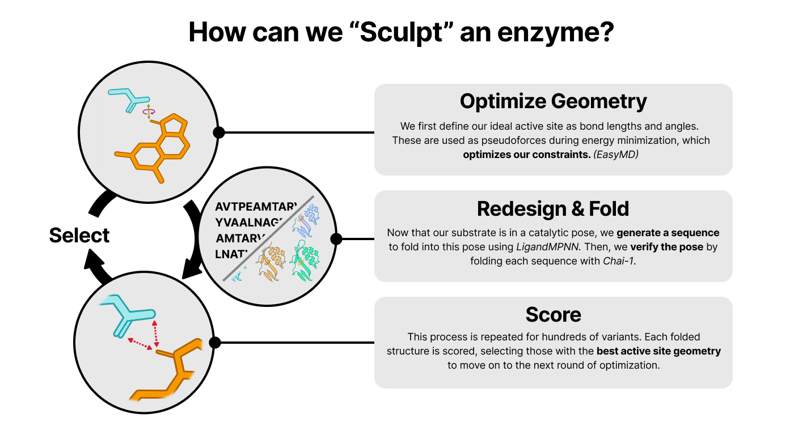

# Sculpt

**Sculpt** — geometry‑first, iterative enzyme design.

Achieving Å‑level catalytic precision by co‑optimizing backbone and sequence on any user‑defined geometric function.

**Authors**: Nicholas Freitas, Giovanni Alviles, Ian Bakanas

> [!IMPORTANT]
> Sculpt is in-development. Alpha code is provided for research & collaboration.
>


# Description



# Sculpt for Substrate switching

We're using Sculpt to confer new activity to an existing Kemp eliminase enzyme, *Ketosteroid Isomerase D38N*.


# Installation

*Sculpt is powered by [Ribbon](https://degrado-lab.github.io/Ribbon/), an open-source package with simplifies the installation and running of protein design software.*

To run Sculpt, first install [Apptainer](https://apptainer.org/docs/admin/main/installation.html#install-ubuntu-packages). 

Then, we recommend creating a fresh environment for Sculpt:

```bash
conda create --name sculpt python=3.12 -y
conda activate sculpt
```

Then, install Ribbon in a clean python environment:
```bash
pip install ribbon-toolkit
```

# Running Sculpt

Sculpt is provided as a simple python script for its current in-development release. You may download the repo as a zip file [here](https://github.com/degrado-lab/Sculpt/archive/refs/heads/main.zip), or use `git clone https://github.com/degrado-lab/Sculpt.git`.

### Example System
We provide an example structure, `PDB 5RGA`, with the transition state analogue for ligand KEMp-1.

### Time to Sculpt
In your python environment, you may run the algorithm using `python sculpt.py`

# License

This project is licensed under the [MIT License](LICENSE).

# Contact

- [Nicholas Freitas](https://github.com/nicholas-freitas)
- [Project Repository](https://github.com/degrado-lab/sculpt)